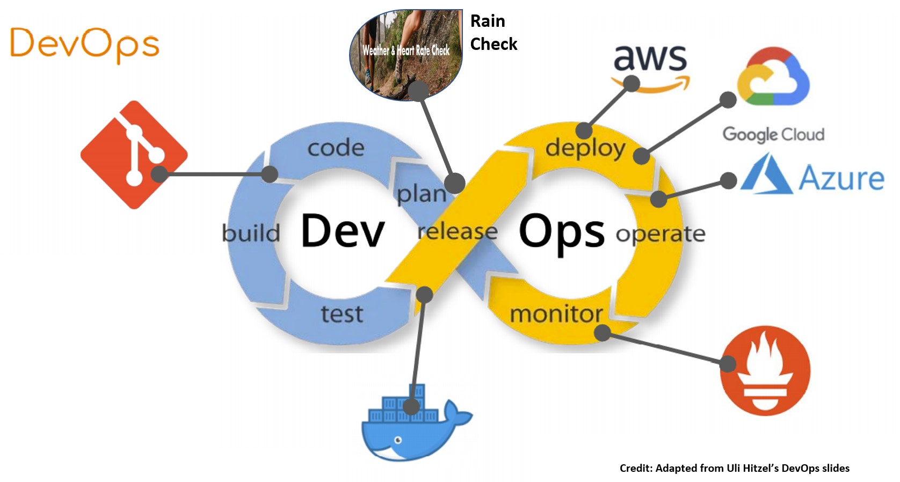

# DevOps: [Rain Check](https://kuddelmuddelall.github.io/Rain-Check/)

### State of DevOps

Fostering a collaborative environment and imposing end-to-end responsibility are often mentioned as [key principles](https://www.cmswire.com/information-management/7-key-principles-for-a-successful-devops-culture/) for fostering successful DevOps culture.

Gallup has indicated that [team building](https://www.gallup.com/cliftonstrengths/en/278225/how-to-improve-teamwork.aspx) fosters better collaboration and responsibility through connectedness.

Sports is often seen as great for team building that also brings about [many positive benefits](https://runnersfirst.co.uk/team-building/#:~:text=Running%20as%20part%20of%20team,re%20doing%20a%20great%20job.) to participants.  Running, in particular, is a sporting activity that anyone can pick up.  With a low barrier to entry, the only thing that will keep a person from going into the outdoors is the weather and the risk of overexertion.

Getting a GROUP of people [to perform as a TEAM](https://medium.com/@XebiaLabs/devops-is-a-team-sport-876555fe3b88) is never easy in DevOps.  However, the fact that DevOps is a teams sport is often overlooked and never factored into the DevOps infinity loop.

### Rain Check - The Missing Piece

To foster the culture of collbobration in DevOps, Rain Check is the missing piece that should be adopted to get the group outdoor so that they may return as a team.

If DevOps is the glue that brings together all the components to increases an organization’s ability to deliver applications and services (RE: Uli), then Rain Check is enabler of that glue that ensures its effectiveness.

### Using [Rain Check](https://kuddelmuddelall.github.io/Rain-Check/)
* Step 1 - Arrange to go for a run or walk with group members
* Step 2 - Nearer to the arranged time, get members to go onto Rain Check to obtain their maximum heart rate.
* Step 3 - Click the "Check Weather" link on Rain Check to see if it is going to rain.
* Step 4a - Start the walk or run if weather is good, while keeping to the maximum heart rate obtained by group members.
* Step 4b - If it is about to rain, stay under shelter for some basic exercises while keeping to the maximum heart rate obtained by team members. 
* Step 5 - Repeat from Step 1 on another day and watch DevOps collaboration improve with each iteration of repeat.
